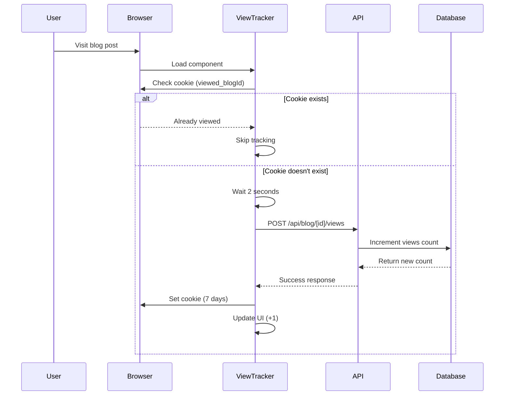

# View Counter Implementation Documentation

This document outlines the complete implementation of the View Counter feature for blog posts in the portfolio application.

## Table of Contents

1. [Overview](#overview)
2. [Architecture](#architecture)
3. [Database Schema](#database-schema)
4. [API Endpoints](#api-endpoints)
5. [Frontend Components](#frontend-components)
6. [View Tracking Logic](#view-tracking-logic)
7. [Cookie-Based Persistence](#cookie-based-persistence)
8. [UI Integration](#ui-integration)
9. [Testing and Debugging](#testing-and-debugging)
10. [Performance Considerations](#performance-considerations)

## Overview

The view counter system tracks unique blog post views using a cookie-based approach with automatic expiration. It provides real-time view count updates with optimistic UI feedback.

### Key Features

- **Unique View Tracking**: One view per blog post per browser session (7-day expiration)
- **Cookie-Based Storage**: Automatic cleanup, no localStorage bloat
- **Optimistic UI Updates**: Immediate visual feedback when views are tracked
- **Cross-Page Consistency**: View counts displayed on detail pages, listings, and homepage
- **Automatic Expiration**: Views reset after 7 days for return visitor tracking

## Architecture

```
┌─────────────────┐    ┌──────────────────┐    ┌─────────────────┐
│   Frontend      │    │   API Endpoint   │    │   Database      │
│                 │    │                  │    │                 │
│ ViewTracker     │───▶│ POST /api/blog/  │───▶│ MongoDB         │
│ Component       │    │ [id]/views       │    │ blogs.views     │
│                 │    │                  │    │                 │
│ useViewTracker  │    │ GET /api/blog/   │    │                 │
│ Hook            │    │ [id]/views       │    │                 │
└─────────────────┘    └──────────────────┘    └─────────────────┘
         │
         ▼
┌─────────────────┐
│   Browser       │
│   Cookies       │
│                 │
│ viewed_blogId   │
│ = true          │
│ (7 days TTL)    │
└─────────────────┘
```

## Database Schema

### Blog Model Updates

The blog schema includes a `views` field to track total view count:

```typescript
// models/blog.ts
export const blogSchema = z.object({
  // ... existing fields
  views: z.number().optional().default(0),
})

// Mongoose Schema
const BlogSchema = new Schema<IBlog>({
  // ... existing fields
  views: {
    type: Number,
    default: 0,
  },
})
```

### Migration Considerations

- **Existing Posts**: Default to 0 views for backward compatibility
- **Optional Field**: Schema handles missing views field gracefully
- **Auto-Increment**: Views are incremented via MongoDB `$inc` operator

## API Endpoints

### POST `/api/blog/[id]/views`

Increments the view count for a specific blog post.

**Request:**

```typescript
POST /api/blog/blog-123/views
Content-Type: application/json
```

**Response:**

```typescript
{
  "success": true,
  "data": {
    "id": "blog-123",
    "views": 42
  }
}
```

**Implementation:**

```typescript
// app/api/blog/[id]/views/route.ts
export async function POST(request: NextRequest, context: { params: Promise<{ id: string }> }) {
  await connectToDatabase()
  const { id } = await context.params

  const updatedBlog = await BlogModels.findOneAndUpdate(
    { id },
    { $inc: { views: 1 } },
    { new: true, upsert: false }
  )

  return NextResponse.json({
    success: true,
    data: { id: updatedBlog.id, views: updatedBlog.views },
  })
}
```

### GET `/api/blog/[id]/views`

Retrieves the current view count for a specific blog post.

**Response:**

```typescript
{
  "success": true,
  "data": {
    "id": "blog-123",
    "views": 42
  }
}
```

## Frontend Components

### ViewTracker Component

Main component for displaying and tracking blog post views.

```typescript
// components/ViewTracker.tsx
interface ViewTrackerProps {
  blogId: string
  initialViews?: number
  className?: string
}

export function ViewTracker({ blogId, initialViews = 0, className = '' }: ViewTrackerProps) {
  const [displayViews, setDisplayViews] = useState(initialViews)

  useViewTracker({
    blogId,
    delay: 2000,
    onTrack: () => setDisplayViews(prev => prev + 1) // Optimistic update
  })

  return (
    <span className={`flex items-center gap-1 text-muted-foreground ${className}`}>
      <Eye className="h-4 w-4" />
      <span>{formatViews(displayViews)} views</span>
    </span>
  )
}
```

### useViewTracker Hook

Custom hook for handling view tracking logic.

```typescript
// hooks/useViewTracker.ts
interface UseViewTrackerOptions {
  blogId: string
  delay?: number
  onTrack?: () => void
}

export function useViewTracker({ blogId, delay = 2000, onTrack }: UseViewTrackerOptions) {
  const hasTracked = useRef(false)

  useEffect(() => {
    // Check if already viewed (cookie exists)
    if (hasViewedPost(blogId)) {
      hasTracked.current = true
      return
    }

    const trackView = async () => {
      const response = await fetch(`/api/blog/${blogId}/views`, { method: 'POST' })
      if (response.ok) {
        hasTracked.current = true
        markPostAsViewed(blogId)
        onTrack?.() // Trigger UI update
      }
    }

    const timer = setTimeout(trackView, delay)
    return () => clearTimeout(timer)
  }, [blogId, delay, onTrack])

  return { hasTracked: hasTracked.current }
}
```

## View Tracking Logic

### Unique View Definition

A "unique view" is defined as:

- **One view per blog post per browser** until cookie expires
- **7-day expiration**: Views reset after 7 days for return visitor tracking
- **Cross-session persistence**: Survives browser restarts and tab closures
- **Per-post tracking**: Each blog post tracked independently

### Tracking Flow



### Delay Logic

- **2-second delay**: Ensures user is actually reading, not just passing through
- **Prevents accidental counts**: Avoids counting quick refreshes or misclicks
- **Engagement indicator**: Only counts users who spend time on the page

## File Structure and Architecture

### Improved Code Organization

The implementation follows industry standards with proper separation of concerns:

```
├── utils/
│   ├── cookies.ts              # Reusable cookie utility functions
│   └── view-tracking.ts        # View tracking business logic
├── hooks/
│   └── useViewTracker.ts       # React hook for view tracking
├── components/
│   └── ViewTracker.tsx         # UI component with optimistic updates
├── app/api/blog/[id]/views/
│   └── route.ts               # API endpoints for view tracking
└── models/
    └── blog.ts                # Updated schema with views field
```

### Key Architectural Improvements

1. **Separated Cookie Utilities** (`utils/cookies.ts`):

   - Industry-standard cookie management
   - Reusable across the application
   - Comprehensive error handling
   - TypeScript interfaces for type safety

2. **Clean Business Logic** (`utils/view-tracking.ts`):

   - Focused on view tracking concerns only
   - Uses cookie utilities for persistence
   - Easy to test and maintain

3. **Optimistic UI Updates** (`components/ViewTracker.tsx`):
   - Immediate visual feedback
   - State management for display count
   - Graceful error handling

## Cookie-Based Persistence

### Cookie Structure

```javascript
// Cookie naming pattern
viewed_[blogId] = true

// Example cookies
viewed_blog-123 = true; expires=Sun, 27 Oct 2024 10:20:17 GMT; path=/; SameSite=Lax
viewed_blog-456 = true; expires=Mon, 28 Oct 2024 15:30:45 GMT; path=/; SameSite=Lax
```

### Cookie Management

```typescript
// Set cookie with 7-day expiration
function setCookie(name: string, value: string, days: number) {
  const expires = new Date()
  expires.setTime(expires.getTime() + days * 24 * 60 * 60 * 1000)
  document.cookie = `${name}=${value}; expires=${expires.toUTCString()}; path=/; SameSite=Lax`
}

// Check if post has been viewed
function hasViewedPost(blogId: string): boolean {
  const cookieName = `viewed_${blogId}`
  return getCookie(cookieName) === 'true'
}
```

### Advantages Over localStorage

- **Automatic expiration**: Browser handles cleanup
- **No storage bloat**: Each post gets one cookie that self-destructs
- **Cross-tab consistency**: Works across all browser tabs
- **Server-side accessible**: Can be read by server if needed

## UI Integration

### Blog Detail Page

```typescript
// app/blogs/[slug]/page.tsx
<ViewTracker blogId={post.id} initialViews={post.views || 0} />
```

### Blog Listing Page

```typescript
// app/blogs/page.tsx
<div className="flex items-center justify-between text-sm text-muted-foreground">
  <span>{publishDate}</span>
  <span className="flex items-center gap-1">
    <Eye className="h-3 w-3" />
    {post.views || 0}
  </span>
</div>
```

### Homepage Recent Posts

```typescript
// app/page.tsx
<div className="flex items-center justify-between text-sm text-muted-foreground">
  <span>{publishDate}</span>
  <span className="flex items-center gap-1">
    <Eye className="h-3 w-3" />
    {post.views || 0}
  </span>
</div>
```

## Testing and Debugging

### Browser Console Utilities

Global debugging functions available in browser console:

```javascript
// Get list of viewed post IDs
viewTracking.getViewedPostIds()
// Returns: ["blog-123", "blog-456"]

// Check if specific post was viewed
viewTracking.hasViewedPost('blog-123')
// Returns: true/false

// Manually mark post as viewed (testing)
viewTracking.markPostAsViewed('blog-789')

// Check expiry setting
viewTracking.getExpiryDays()
// Returns: 7
```

### Testing Scenarios

1. **Fresh Visit**: Visit post in incognito mode → should increment after 2s
2. **Return Visit**: Refresh page → should not increment again
3. **Cross-tab**: Open same post in new tab → should not increment
4. **Different Posts**: Visit different posts → each should increment once
5. **Expiry Test**: Wait 7 days or manually expire cookies → should increment again

### Development Tools

```typescript
// utils/view-tracking.ts - Debug utilities
export function getViewedPostIds(): string[]
export function hasViewedPost(blogId: string): boolean
export function markPostAsViewed(blogId: string): void
```

## Performance Considerations

### Database Impact

- **Minimal overhead**: Single `$inc` operation per unique view
- **Connection caching**: Uses existing MongoDB connection pool
- **Async operation**: View tracking doesn't block page rendering

### Frontend Performance

- **Lazy tracking**: 2-second delay reduces unnecessary API calls
- **Cookie efficiency**: Lightweight storage, browser-managed cleanup
- **Optimistic updates**: Immediate UI feedback without waiting for API

### Scalability

- **Cookie limits**: ~4KB per cookie, minimal impact
- **Database growth**: Views field adds minimal storage overhead
- **API efficiency**: Simple increment operation, highly cacheable

### Memory Usage

- **No localStorage bloat**: Cookies auto-expire and cleanup
- **Bounded growth**: Maximum one cookie per blog post
- **Browser managed**: No manual cleanup required

## Error Handling

### API Failures

```typescript
// Graceful degradation
try {
  const response = await fetch(`/api/blog/${blogId}/views`, { method: 'POST' })
  if (response.ok) {
    // Success: update UI and set cookie
  }
} catch (error) {
  // Failure: log error, don't update UI
  console.error('Failed to track view:', error)
}
```

### Cookie Failures

```typescript
// Safe cookie operations
try {
  setCookie(cookieName, 'true', VIEW_EXPIRY_DAYS)
} catch (error) {
  // Fallback: continue without persistence
  console.error('Failed to set cookie:', error)
}
```

### Database Failures

- **Non-blocking**: View tracking failures don't affect page functionality
- **Logging**: Errors logged for monitoring and debugging
- **Graceful degradation**: Page continues to work without view tracking

## Future Enhancements

### Potential Improvements

1. **Analytics Dashboard**: Admin interface to view popular posts
2. **Time-based Analytics**: Track views by day/week/month
3. **User Segmentation**: Track unique vs returning visitors
4. **Geographic Tracking**: IP-based location analytics
5. **Real-time Updates**: WebSocket-based live view count updates
6. **A/B Testing**: Different tracking strategies for comparison

### Configuration Options

```typescript
// Configurable settings
const VIEW_TRACKING_CONFIG = {
  EXPIRY_DAYS: 7, // Cookie expiration
  DELAY_MS: 2000, // Tracking delay
  ENABLE_TRACKING: true, // Feature toggle
  BATCH_UPDATES: false, // Batch API calls
}
```

This view counter implementation provides a robust, scalable solution for tracking blog post engagement while maintaining good user experience and performance characteristics.
